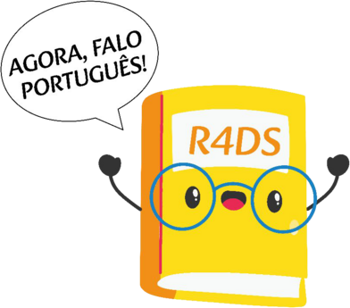

## Cronograma

- R-Ladies São Paulo

- Projetos de tradução com a comunidade R

## Beatriz Milz

:::: {.columns}
::: {.column width="30%"}

:::

::: {.column width="70%"}
-   Doutorado em Ciência Ambiental (IEE/USP), estágio pós-doutoral na UFABC (bolsista FAPESP).

-   Co-organizadora da [R-Ladies São Paulo](https://rladies-sp.org/) desde 2018.

-   Editora de revisão de software na [rOpenSci](https://ropensci.org/author/beatriz-milz/) desde 2024.

- [GitHub Star](https://stars.github.com/profiles/beatrizmilz).

-   Mãe do Eduardo.

-   Site: [beamilz.com](https://beamilz.com)
:::
::::

## Geovana Lopes Batista

:::: {.columns}
::: {.column width="30%"}

:::

::: {.column width="70%"}
-   Cientista de dados no Banco BMG.

-   Formada em Matemática pela USP e graduanda em Estatística no IME-USP.

-   Pós-graduação em Ciência de Dados pelo IFSP.

-   Co-organizadora da [R-Ladies São Paulo](https://rladies-sp.org/).

-   [GitHub](https://github.com/GeovanaLopes) \| [LinkedIn](https://br.linkedin.com/in/geovanalopes)
:::
::::

# R-Ladies SP {background-color="#562457"}

```{r include=FALSE}
# Base de dados
url <- "https://benubah.github.io/r-community-explorer/data/rladies.csv"

fs::dir_create("data")

download.file(url, "data/rladies.csv", method = "curl")

rladies <- readr::read_csv("data/rladies.csv") |> tibble::as_tibble()


meetup_url <- rladies |>
  dplyr::filter(city == "São Paulo") |> 
  dplyr::pull(fullurl)

```

## O que é a R-Ladies?

R-Ladies é uma organização mundial cuja missão é promover a diversidade de gênero na comunidade da linguagem R.

R-Ladies São Paulo integra, orgulhosamente, a organização R-Ladies Global, em São Paulo.

## Como?

Através de meetups e mentorias em um ambiente seguro e amigável.

Nosso principal objetivo é promover a linguagem computacional estatística R compartilhando conhecimento, assim, quem tiver interesse na linguagem será bem-vinda, independente do nível de conhecimento.

::: footer
Fonte: [About us - R-Ladies](https://rladies.org/about-us/), [Meetup - São Paulo](https://www.meetup.com/rladies-sao-paulo/)
:::

## Para quem?

Nosso principal público-alvo são as pessoas que se identificam com gêneros sub-representados na comunidade R, portanto: mulheres cis, mulheres trans, homens trans, pessoas não-binárias e queer.

## Missão

Como uma iniciativa de diversidade, a missão das R-Ladies é alcançar uma representação proporcional de pessoas de gêneros atualmente sub-representados na comunidade R, incentivando, inspirando e capacitando-as.

## Código de conduta

A R-Ladies dedica-se a proporcionar uma experiência livre de assédio para todas as pessoas partcicipantes, desta forma, não é tolerada nenhuma forma de assédio. [Código de conduta - R-Ladies](https://github.com/rladies/starter-kit/wiki/Code-of-Conduct#portuguese)

::: footer
Fonte: [About us - R-Ladies](https://rladies.org/about-us/), [Meetup - São Paulo](https://www.meetup.com/rladies-sao-paulo/)
:::

## R-Ladies - Capítulos no mundo

```{r echo=FALSE}
rladies |>  
  dplyr::group_by(region) |> 
  dplyr::summarise(n_capitulos = dplyr::n(), 
            total_participantes = sum(members, na.rm = TRUE)) |> 
  dplyr::arrange(dplyr::desc(n_capitulos)) |>
  knitr::kable(col.names =  c("Região", "Número de Capítulos", "Total de participantes"))
  
```

::: footer
Atualizado em: `r  format(Sys.time(), '%m/%Y')`. Fonte: [R Community Explorer](https://benubah.github.io/r-community-explorer/rladies.html)
:::

## R-Ladies no Brasil

```{r echo=FALSE}
rladies_br <- rladies |>
  dplyr::arrange(desc(members)) |>
  dplyr::filter(country == "Brazil") |>
  dplyr::mutate(name = paste0("<a href='", fullurl, "' target='_blank'>", name, "</a>")) |>
  dplyr::select(name, members)

```

```{r}
rladies_br |>
  dplyr::slice(1:9) |>  
  knitr::kable(col.names = c("Capítulo", "Participantes"))

```

::: footer
Atualizado em: `r  format(Sys.time(), '%m/%Y')`. Fonte: [R Community Explorer](https://benubah.github.io/r-community-explorer/rladies.html)
:::

## R-Ladies no Brasil

```{r}
rladies_br |>
  dplyr::slice(10:dplyr::n()) |>
  knitr::kable(col.names = c("Capítulo", "Participantes"))

```

```{r include=FALSE}
pessoas_participantes <- rladies |> 
  dplyr::filter(city == "São Paulo") |>
  dplyr::select(members) |>
  dplyr::pull()

primeiro_meetup <-  rladies |>
  dplyr::filter(city == "São Paulo") |> 
  dplyr::pull(created) 
```

::: footer
Atualizado em: `r  format(Sys.time(), '%m/%Y')`. Fonte: [R Community Explorer](https://benubah.github.io/r-community-explorer/rladies.html)
:::

## R-Ladies em São Paulo

```{r out.width="65%", fig.align='center'}
knitr::include_graphics("https://beatrizmilz.github.io/slidesR/rladies/img/1meetupsp.jpeg")
```

-   **Primeiro encontro da R-Ladies São Paulo** - `r format(primeiro_meetup, format='%Y')`

-   **+ `r pessoas_participantes` pessoas participantes** - `r format(Sys.Date(), format='%m/%Y')`

## GuGuDaDados

Primeira edição em novembro/2022.

{fig-align="center" width="45%"}

## Blog: rladies-sp.org

-   Textos escritos por pessoas da comunidade

[{fig-align="center"}](https://rladies-sp.org/)

## Saiba mais sobre a R-Ladies

-   R-Ladies Global: [Website](https://rladies.org/), [<i class="fab fa-twitter"></i> Twitter](https://twitter.com/rladiesglobal)

-   R-Ladies São Paulo:

    -   Blog: <https://rladies-sp.org/>
    -   [<i class="fab fa-linkedin"></i> Linkedin](https://www.linkedin.com/company/r-ladies-sao-paulo/)
    -   [<i class="fab fa-twitter"></i> Twitter](https://twitter.com/RLadiesSaoPaulo)
    -   [<i class="fab fa-instagram"></i> Instagram](https://instagram.com/RLadiesSaoPaulo)
    -   [<i class="fab fa-facebook"></i> Facebook](https://facebook.com/RLadiesSaoPaulo)
    -   [<i class="fab fa-meetup"></i> Meetup](https://www.meetup.com/rladies-sao-paulo/)
    -   [<i class="fab fa-github"></i> GitHub](https://github.com/R-Ladies-Sao-Paulo)
    -   [<i class="fab fa-youtube"></i> Youtube](https://www.youtube.com/c/RLadiesSãoPaulo)

# Projetos de tradução com a comunidade R {background-color="#562457"}

## Por que traduzir?

:::: {.columns}
::: {.column width="60%"}
-   Muitos recursos para aprender R estão disponíveis apenas em inglês.

-   Traduzir amplia o acesso a conteúdos técnicos e democratiza o conhecimento.

-   Exemplo: o livro *R for Data Science* é gratuito online em inglês, mas a 1ª edição em português estava disponível apenas impressa (R\$ 120 a R\$ 150).
:::

::: {.column width="40%"}

:::
::::

::: footer
Ilustração: Ariana Cabral
:::

## Pacote dados (2020)

-   Tradução das bases de dados usadas no livro *R for Data Science*.

-   Inspirado no pacote `{datos}`, em espanhol.

-   Coordenação: Riva Quiroga e Beatriz Milz (R-Ladies SP).

-   11 pessoas voluntárias de 3 países (Brasil, Chile e Colômbia).

-   Disponível no [CRAN](https://cran.r-project.org/web/packages/dados/index.html).

{.nostretch fig-align="center" width="50%"}

## Livro R para Ciência de Dados

:::: {.columns}
::: {.column width="70%"}
-   2021: no **Clube do livro da R-Ladies SP**, vimos que a 2ª edição estava sendo escrita e [pedimos permissão](https://github.com/hadley/r4ds/issues/955) para traduzir.

-   Set/2023 a nov/2024: tradução da 2ª edição.

    -   Coordenação: Beatriz Milz. Orientação: Riva Quiroga.
    -   22 pessoas participaram: cada capítulo foi traduzido por uma pessoa e revisado por duas.

-   Disponível gratuitamente em: <https://pt.r4ds.hadley.nz/>
:::

::: {.column width="30%"}

:::
::::

::: footer
Ilustração: Ariana Cabral
:::

## Livro R para Ciência de Dados: equipe

22 pessoas participaram da tradução e revisão!

{fig-align="center" width="55%"}

{fig-align="center" width="55%"}

## Livro R para Ciência de Dados: como fizemos

:::: {.columns}
::: {.column width="60%"}
-   Comunidades como a R-Ladies ajudaram a encontrar pessoas voluntárias.

-   GitHub: issues, pull requests e projects para organizar o trabalho.

-   [Guia de tradução](https://cienciadedatos.github.io/guia-traducao-ptbr/): facilitou a participação de pessoas sem experiência prévia com GitHub.

-   Divulgação: [Clube do livro R-Ladies SP](https://youtube.com/playlist?list=PLufjVrrUAoSdAk_I8l_MJRCwS8P_R-isY), organizado por Luana Antunes e Beatriz Milz.
:::

::: {.column width="40%"}

:::
::::

## DevGuide da rOpenSci

:::: {.columns}
::: {.column width="65%"}
-   Guia sobre desenvolvimento, manutenção e avaliação por pares de pacotes em R.

-   Coordenação: Yanina Bellini Saibene e Pedro Faria.

-   2024: [Community Call](https://ropensci.org/commcalls/translation-portuguese/) "A comunidade R fala português" e Traslatón na LatinR.

-   Disponível em: [devguide.ropensci.org/pt](https://devguide.ropensci.org/pt/index.pt.html)
:::

::: {.column width="35%"}

:::
::::

## Tradução das mensagens do R

:::: {.columns}
::: {.column width="55%"}
-   Tradução das mensagens (erros, avisos, etc.) do R e dos pacotes do "R base".

-   Coordenação em português: Caio Lente e Renata Hirota.

-   2022: R Traslatón na LatinR, em parceria com o R Contributors.

-   **Projeto aberto para contribuições!**
:::

::: {.column width="45%"}

:::
::::

::: footer
Fonte do gráfico: [Blog do R](https://blog.r-project.org/2022/07/25/r-can-use-your-help-translating-r-messages/)
:::

## Mensagens do R: em inglês

```{r}
#| include: false
Sys.setenv(LANGUAGE = "en")
```

```{r}
#| echo: true
#| error: true
mean(notas)

library(tidyvese)
```

## Mensagens do R: em português

Mudando o idioma das mensagens:

```{r}
#| echo: true
Sys.setenv(LANGUAGE = "pt_BR")
```

O mesmo código, agora com as mensagens traduzidas:

```{r}
#| echo: true
#| error: true
mean(notas)

library(tidyvese)
```

## Como contribuir?

1.  Entre no [Slack do R Contributors](https://contributor.r-project.org/slack) e se apresente no canal `#core-translations`.

2.  Crie uma conta no [Weblate](https://translate.rx.studio/), a plataforma onde as traduções são feitas.

3.  Leia as [orientações para tradução em português](https://contributor.r-project.org/translations/Conventions_for_Languages/Brazilian%E2%80%90Portugese-specific-translations.html).

4.  Escolha um [componente em português](https://translate.rx.studio/languages/pt_BR/r-project/) que não esteja 100% traduzido.

    -   Dica: comece por pacotes como `parallel` ou `methods`. Pacotes como `stats` têm muitos termos técnicos.

5.  Clique em *Unfinished strings* e comece a traduzir!

## Weblate

{fig-align="center"}

::: footer
Mais informações: [R Contributors - Translations](https://contributor.r-project.org/translations/)
:::

## E a R-Ladies nisso tudo?

-   O pedido para traduzir a 2ª edição do R4DS surgiu no Clube do livro da R-Ladies SP.

-   Comunidades como a R-Ladies, a LatinR e a Curso-R foram essenciais para encontrar pessoas voluntárias.

-   O Clube do livro da R-Ladies SP ajuda a divulgar o livro traduzido.

::: r-hstack
{height="150"}

{height="150"}

{height="80"}
:::

<!-- inicio font awesome -->

```{=html}
<script src="https://kit.fontawesome.com/1f72d6921a.js" crossorigin="anonymous"></script>
```

<!-- final font awesome -->
