## Cronograma

-   Quem somos

-   R-Ladies São Paulo

-   Projetos de tradução com a comunidade R

    -   Pacote dados
    -   Livro R para Ciência de Dados
    -   DevGuide da rOpenSci
    -   Tradução das mensagens do R

-   Faça parte!

## Beatriz Milz

:::: {.columns}
::: {.column width="30%"}
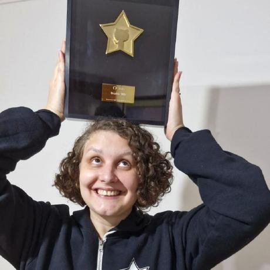
:::

::: {.column width="70%"}
-   Doutorado em Ciência Ambiental (IEE/USP), estágio pós-doutoral na UFABC (bolsista FAPESP).

-   Co-organizadora da [R-Ladies São Paulo](https://rladies-sp.org/) desde 2018.

-   Editora de revisão de software na [rOpenSci](https://ropensci.org/author/beatriz-milz/) desde 2024.

- [GitHub Star](https://stars.github.com/profiles/beatrizmilz).

-   Mãe do Eduardo.

-   Site: [beamilz.com](https://beamilz.com)
:::
::::

## Geovana Lopes Batista

:::: {.columns}
::: {.column width="30%"}
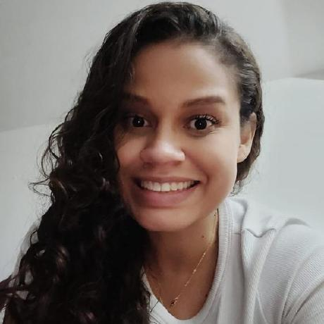
:::

::: {.column width="70%"}
-   Cientista de dados no Banco BMG.

-   Formada em Matemática pela USP e graduanda em Estatística no IME-USP.

-   Pós-graduação em Ciência de Dados pelo IFSP.

-   Co-organizadora da [R-Ladies São Paulo](https://rladies-sp.org/).

-   [GitHub](https://github.com/GeovanaLopes) \| [LinkedIn](https://br.linkedin.com/in/geovanalopes)
:::
::::

# R-Ladies SP {background-color="#562457"}

```{r include=FALSE}
# Base de dados: https://github.com/rladies/meetup_archive
url_base <- "https://raw.githubusercontent.com/rladies/meetup_archive/main/data/"

data_atualizacao <- as.Date(jsonlite::fromJSON(paste0(url_base, "updated.json"))$date)

# status: "past" (realizado), "active" (agendado) ou "cancelled"
eventos <- jsonlite::fromJSON(paste0(url_base, "events.json")) |>
  tibble::as_tibble() |>
  dplyr::transmute(
    urlname = group_urlname,
    titulo = title,
    link,
    status,
    data = as.Date(datetime)
  )

eventos_realizados <- eventos |>
  dplyr::filter(status == "past") |>
  dplyr::summarise(
    primeiro_evento = min(data),
    ultimo_evento = max(data),
    .by = urlname
  )

eventos_todos <- eventos |>
  dplyr::summarise(ultimo_evento_qualquer_status = max(data), .by = urlname)

rladies <- jsonlite::fromJSON(paste0(url_base, "chapters.json")) |>
  tibble::as_tibble() |>
  dplyr::left_join(eventos_realizados, by = "urlname") |>
  dplyr::left_join(eventos_todos, by = "urlname") |>
  dplyr::mutate(
    meetup_url = paste0("https://www.meetup.com/", urlname, "/"),
    # Ativo: evento nos últimos 12 meses, mesmo que agendado ou cancelado
    ativo = !is.na(ultimo_evento_qualquer_status) &
      ultimo_evento_qualquer_status >= data_atualizacao - 365,
    regiao = dplyr::case_when(
      country_acronym %in% c("us", "ca") ~ "EUA e Canadá",
      grepl("^America|Galapagos", timezone) ~ "América Latina",
      grepl("^Europe", timezone) ~ "Europa",
      grepl("^Africa", timezone) ~ "África",
      grepl("^Asia", timezone) ~ "Ásia",
      .default = "Oceania"
    )
  )

```

## O que é a RLadies+?

RLadies+ é uma organização mundial cuja missão é promover a diversidade de gênero na comunidade da linguagem R.

R-Ladies São Paulo integra, orgulhosamente, a organização RLadies+ Global, em São Paulo.

## Como?

Através de meetups e mentorias em um ambiente seguro e amigável.

Nosso principal objetivo é promover a linguagem computacional estatística R compartilhando conhecimento, assim, quem tiver interesse na linguagem será bem-vinda, independente do nível de conhecimento.

::: footer
Fonte: [About us - R-Ladies](https://rladies.org/about-us/), [Meetup - São Paulo](https://www.meetup.com/rladies-sao-paulo/)
:::

## Para quem?

Nosso principal público-alvo são as pessoas que se identificam com gêneros sub-representados na comunidade R, portanto: mulheres cis e trans, homens trans, pessoas não-binárias, genderqueer e agênero.

## Missão

Como uma iniciativa de diversidade, a missão da RLadies+ é alcançar uma representação proporcional de pessoas de gêneros atualmente sub-representados na comunidade R, incentivando, inspirando e capacitando-as.

## Código de conduta

A RLadies+ dedica-se a proporcionar uma experiência livre de assédio para todas as pessoas participantes, desta forma, não é tolerada nenhuma forma de assédio. [Código de conduta - R-Ladies](https://github.com/rladies/starter-kit/wiki/Code-of-Conduct#portuguese)

::: footer
Fonte: [About us - R-Ladies](https://rladies.org/about-us/), [Meetup - São Paulo](https://www.meetup.com/rladies-sao-paulo/)
:::

## RLadies+: capítulos no mundo

```{r echo=FALSE}
rladies |>
  dplyr::summarise(
    n_capitulos = dplyr::n(),
    n_ativos = sum(ativo),
    total_participantes = sum(members, na.rm = TRUE),
    .by = regiao
  ) |>
  dplyr::arrange(dplyr::desc(n_capitulos)) |>
  knitr::kable(col.names = c("Região", "Capítulos", "Capítulos ativos", "Participantes"))
  
```

::: footer
Atualizado em: `r format(data_atualizacao, '%d/%m/%Y')`. Ativo: evento no Meetup nos últimos 12 meses, incluindo agendados e cancelados. Fonte: [RLadies+ Meetup Archive](https://github.com/rladies/meetup_archive)
:::

## RLadies+ no Brasil: capítulos ativos

```{r echo=FALSE}
rladies_br <- rladies |>
  dplyr::filter(country_acronym == "br") |>
  dplyr::arrange(dplyr::desc(ultimo_evento)) |>
  dplyr::mutate(
    name = sub("^R-Ladies\\+? ", "", name),
    name = paste0("<a href='", meetup_url, "' target='_blank'>", name, "</a>"),
    ultimo_evento = dplyr::coalesce(format(ultimo_evento, "%m/%Y"), "Nenhum evento")
  )

tabela_br <- function(dados) {
  dados |>
    dplyr::select(name, members, ultimo_evento) |>
    knitr::kable(col.names = c("Capítulo", "Participantes", "Último evento realizado"))
}
```

```{r}
rladies_br |>
  dplyr::filter(ativo) |>
  tabela_br()
```

::: footer
Atualizado em: `r format(data_atualizacao, '%d/%m/%Y')`. Ativo: evento no Meetup nos últimos 12 meses, incluindo agendados e cancelados. Fonte: [RLadies+ Meetup Archive](https://github.com/rladies/meetup_archive)
:::

## RLadies+ no Brasil: outros capítulos {.smaller}

:::: {.columns}
::: {.column width="50%"}
```{r}
inativos_br <- rladies_br |>
  dplyr::filter(!ativo)

metade <- ceiling(nrow(inativos_br) / 2)

inativos_br |>
  dplyr::slice(1:metade) |>
  tabela_br()
```
:::

::: {.column width="50%"}
```{r}
inativos_br |>
  dplyr::slice((metade + 1):dplyr::n()) |>
  tabela_br()
```
:::
::::

```{r include=FALSE}
rladies_sp <- rladies |>
  dplyr::filter(urlname == "rladies-sao-paulo")

pessoas_participantes <- rladies_sp$members

primeiro_meetup <- rladies_sp$primeiro_evento
```

::: footer
Atualizado em: `r format(data_atualizacao, '%d/%m/%Y')`. Ativo: evento no Meetup nos últimos 12 meses, incluindo agendados e cancelados. Fonte: [RLadies+ Meetup Archive](https://github.com/rladies/meetup_archive)
:::

## R-Ladies em São Paulo

```{r out.width="65%", fig.align='center'}
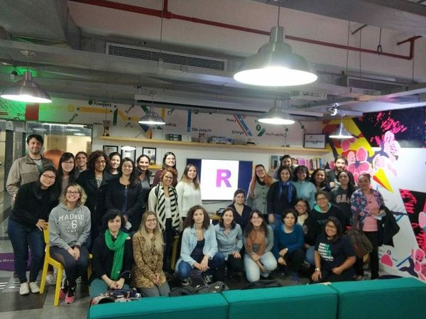
```

-   **Primeiro encontro da R-Ladies São Paulo** - `r format(primeiro_meetup, format='%Y')`

-   **+ `r pessoas_participantes` pessoas participantes** - `r format(data_atualizacao, format='%m/%Y')`

## GuGuDaDados

Primeira edição em novembro/2022.

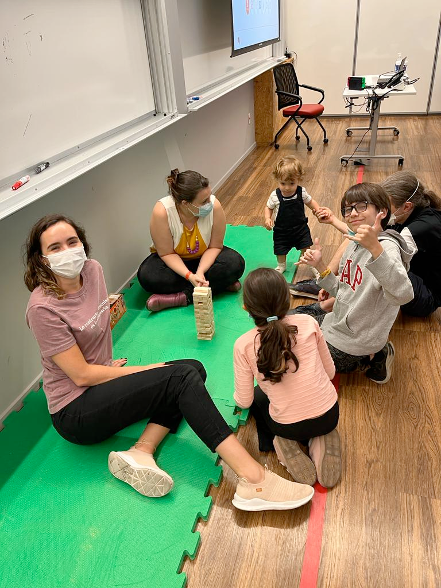{fig-align="center" width="45%"}

## Blog: rladies-sp.org

-   Textos escritos por pessoas da comunidade

[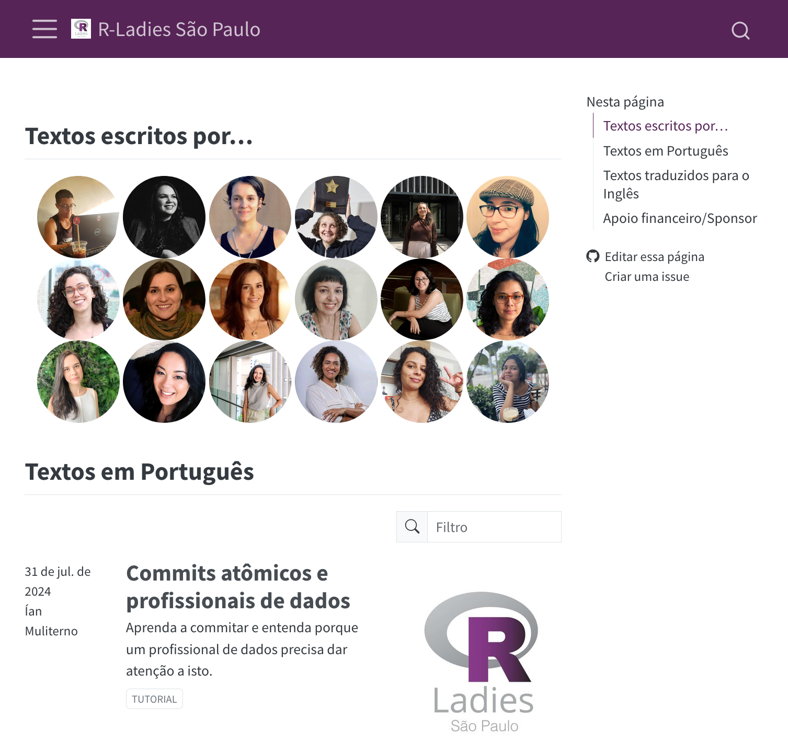{fig-align="center"}](https://rladies-sp.org/)

# Projetos de tradução com a comunidade R {background-color="#562457"}

## Por que traduzir?

:::: {.columns}
::: {.column width="60%"}
-   Muitos recursos para aprender R estão disponíveis apenas em inglês.

-   Traduzir amplia o acesso a conteúdos técnicos e democratiza o conhecimento.

-   Mesmo com ferramentas de IA, traduções feitas e revisadas pela comunidade continuam importantes.
:::

::: {.column width="40%"}
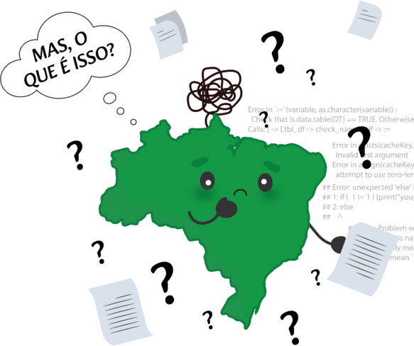
:::
::::

::: notes
IA ainda erra termos técnicos, não mantém um vocabulário consistente e precisa de revisão de pessoas que conhecem a área.
:::

::: footer
Ilustração: Ariana Cabral
:::

## Vamos falar de 4 projetos

1.  Pacote dados
2.  Livro R para Ciência de Dados
3.  DevGuide da rOpenSci
4.  Tradução das mensagens do R

Comunidades envolvidas: [RLadies+](https://rladies.org/), [R-Ladies São Paulo](https://rladies-sp.org/), [LatinR](https://latinr.org/), [Curso-R](https://curso-r.com/), [rOpenSci](https://ropensci.org/) e [R Contribution Working Group](https://contributor.r-project.org/working-group.html).

# Pacote dados {background-color="#562457"}

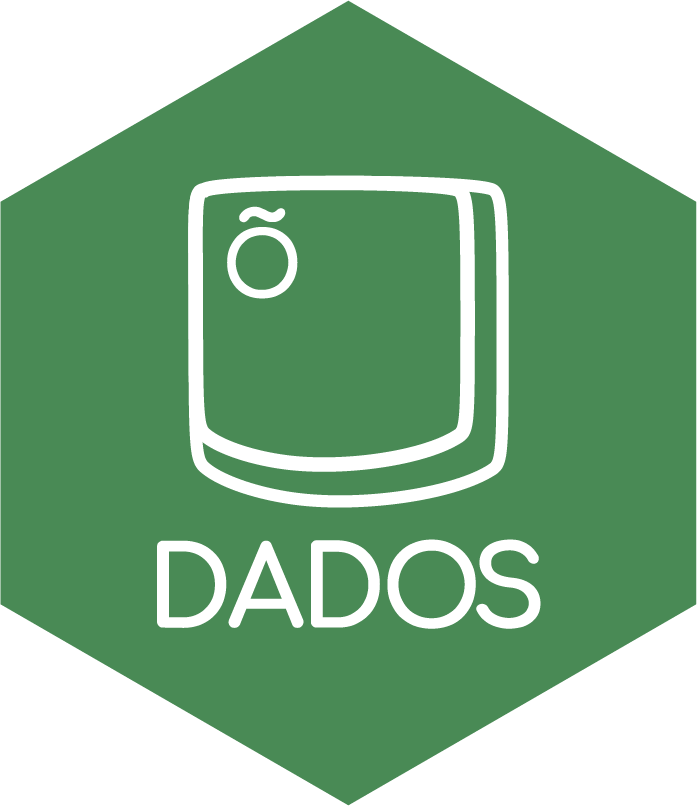{fig-align="center" height="400"}

## Pacote dados (2020)

-   Tradução das bases de dados usadas no livro *R for Data Science*: documentação, nomes das colunas e valores das colunas categóricas e de texto.

-   Inspirado no pacote `{datos}`, em espanhol.

-   Coordenação: [Riva Quiroga](https://rivaquiroga.cl/) e Beatriz Milz.


-   Disponível no [CRAN](https://cran.r-project.org/web/packages/dados/index.html).

-   GitHub: issues, pull requests e projects para organizar o trabalho.


## Equipe

-   11 pessoas voluntárias de 3 países (Brasil, Chile e Colômbia).

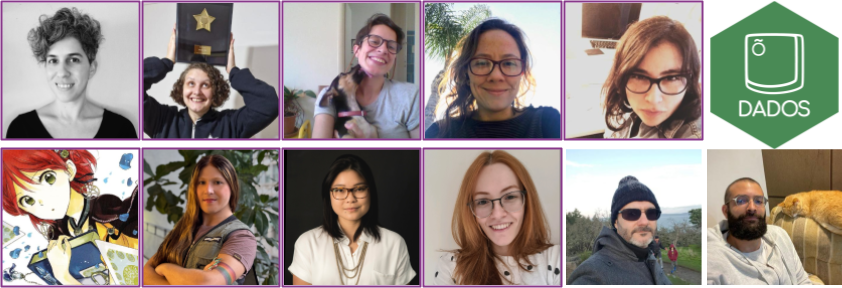{.nostretch fig-align="center" width="100%"}


## Site do pacote dados

[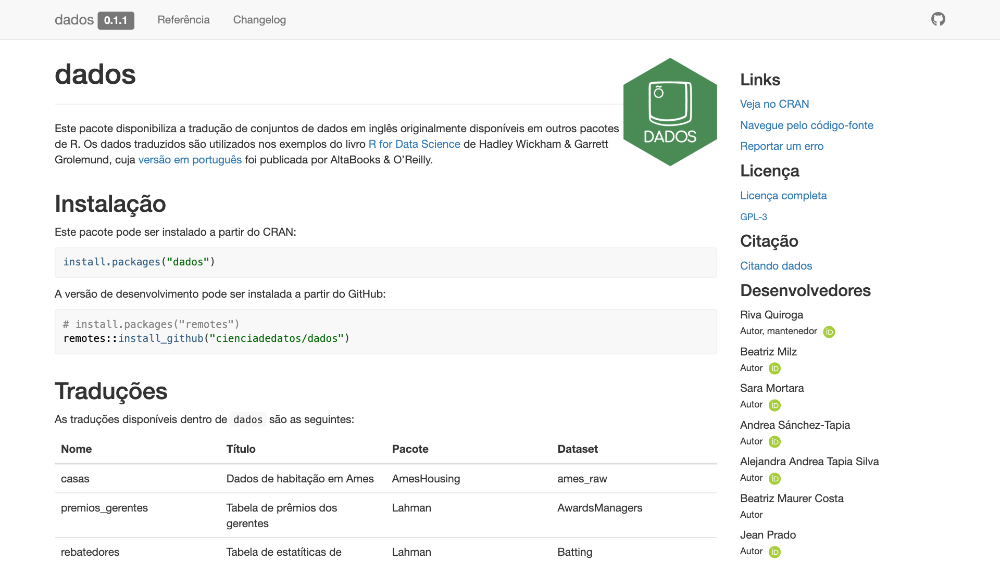{fig-align="center"}](https://cienciadedatos.github.io/dados/)

## Pacote dados: exemplo

<!-- Saída gerada com a versão 46d1fed do pacote no GitHub (o exemplo não é executado ao renderizar) -->

```r
# install.packages("remotes")
remotes::install_github("cienciadedatos/dados") # instalar o pacote
library(dados) # carregar o pacote
dados_starwars # exemplo: base starwars
```

```
# A tibble: 87 × 14
  nome           altura massa cor_do_cabelo cor_da_pele  cor_dos_olhos
  <chr>           <int> <dbl> <chr>         <chr>        <chr>        
1 Luke Skywalker    172    77 Loiro         Branca clara Azul         
2 C-3PO             167    75 <NA>          Ouro         Amarelo      
3 R2-D2              96    32 <NA>          Branca, Azul Vermelho     
4 Darth Vader       202   136 Nenhum        Branca       Amarelo      
5 Leia Organa       150    49 Castanho      Clara        Castanho     
# ℹ 82 more rows
# ℹ 8 more variables: ano_nascimento <dbl>, sexo_biologico <chr>,
#   genero <chr>, planeta_natal <chr>, especie <chr>, filmes <list>,
#   veiculos <list>, naves_espaciais <list>
```

# Livro R para Ciência de Dados {background-color="#562457"}

{fig-align="center" height="400"}

## O livro R for Data Science

-   Livro para aprender ciência de dados com R e o tidyverse: importar, arrumar, transformar, visualizar e modelar dados.

-   Autoria: Hadley Wickham, Mine Çetinkaya-Rundel e Garrett Grolemund.

-   Gratuito online ([r4ds.hadley.nz](https://r4ds.hadley.nz/)) e à venda impresso (O'Reilly).

## Quem escreveu o livro?

:::: {.columns}
::: {.column width="70%"}
-   **Hadley Wickham**: cientista-chefe da Posit (antiga RStudio), lidera a equipe do tidyverse e criou pacotes como ggplot2 e dplyr.

-   **Mine Çetinkaya-Rundel**: professora do Departamento de Ciência Estatística da Duke University, trabalha com ensino de estatística e ciência de dados.

-   **Garrett Grolemund**: autor do livro *Hands-On Programming with R* e um dos autores do pacote lubridate.
:::

::: {.column width="30%"}
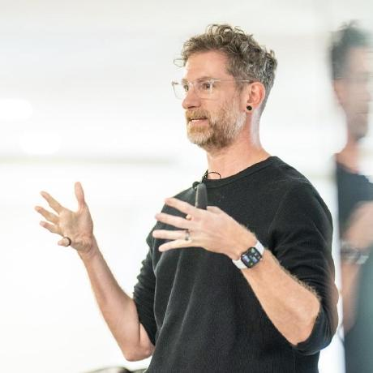
:::
::::

::: footer
Fontes: [hadley.nz](https://hadley.nz/), [mine-cr.com](https://mine-cr.com/), [Hands-On Programming with R](https://rstudio-education.github.io/hopr/)
:::

## Livro R para Ciência de Dados

:::: {.columns}
::: {.column width="70%"}
-   A 1ª edição em português estava disponível apenas impressa (R\$ 120 a R\$ 150).

-   2021: no **Clube do livro da R-Ladies SP**, vimos que a 2ª edição estava sendo escrita e [pedimos permissão](https://github.com/hadley/r4ds/issues/955) para traduzir.

-   Set/2023 a nov/2024: tradução da 2ª edição.

    -   Coordenação: Beatriz Milz. Orientação: Riva Quiroga.

-   Disponível gratuitamente em: [pt.r4ds.hadley.nz](https://pt.r4ds.hadley.nz/)
:::

::: {.column width="30%"}

:::
::::


## Livro R para Ciência de Dados: equipe

22 pessoas participaram: cada capítulo foi traduzido por uma pessoa e revisado por duas.

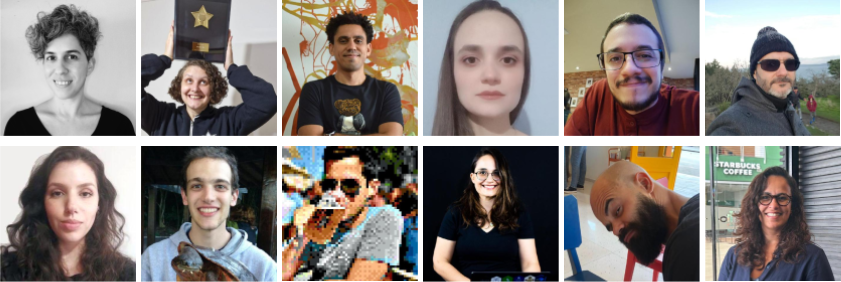{fig-align="center" width="55%"}

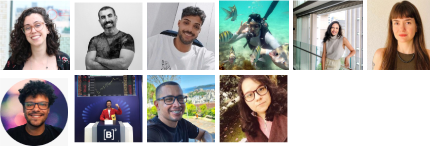{fig-align="center" width="55%"}

## Livro R para Ciência de Dados: como fizemos

:::: {.columns}
::: {.column width="60%"}
-   Comunidades como a R-Ladies ajudaram a encontrar pessoas voluntárias.

-   GitHub: issues, pull requests e projects para organizar o trabalho.

-   [Guia de tradução](https://cienciadedatos.github.io/guia-traducao-ptbr/): facilitou a participação de pessoas sem experiência prévia com GitHub.

-   Divulgação: [Clube do livro R-Ladies SP](https://youtube.com/playlist?list=PLufjVrrUAoSdAk_I8l_MJRCwS8P_R-isY), organizado por Luana Antunes e Beatriz Milz.
:::

::: {.column width="40%"}
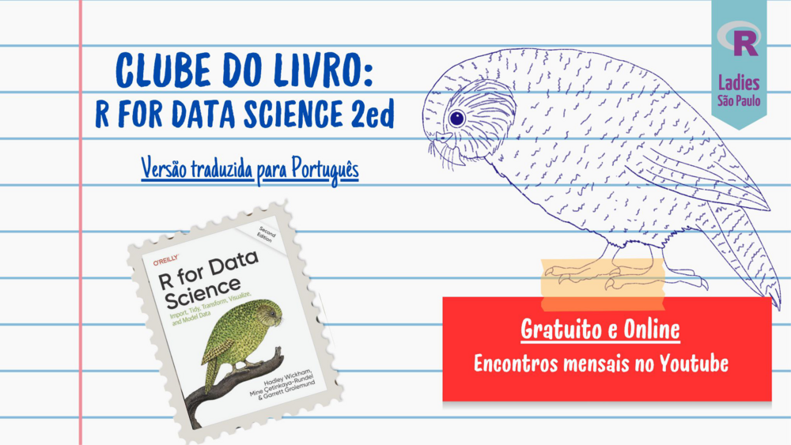
:::
::::

## Aprendendo Git e GitHub

-   Muitas pessoas voluntárias não sabiam usar Git e GitHub.

-   Apoio: o guia de tradução e chamadas de ajuda.

-   Várias pessoas contaram que aprender Git e GitHub foi um dos ganhos de participar do projeto.

-   Git e GitHub são muito usados no mercado de trabalho: para versionar código, colaborar em equipe e mostrar portfólio.

## Guia de tradução: Git e GitHub

[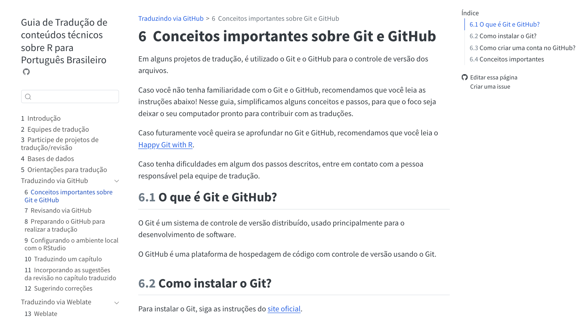{fig-align="center"}](https://cienciadedatos.github.io/guia-traducao-ptbr/git-github.html)

## Site do livro em português

[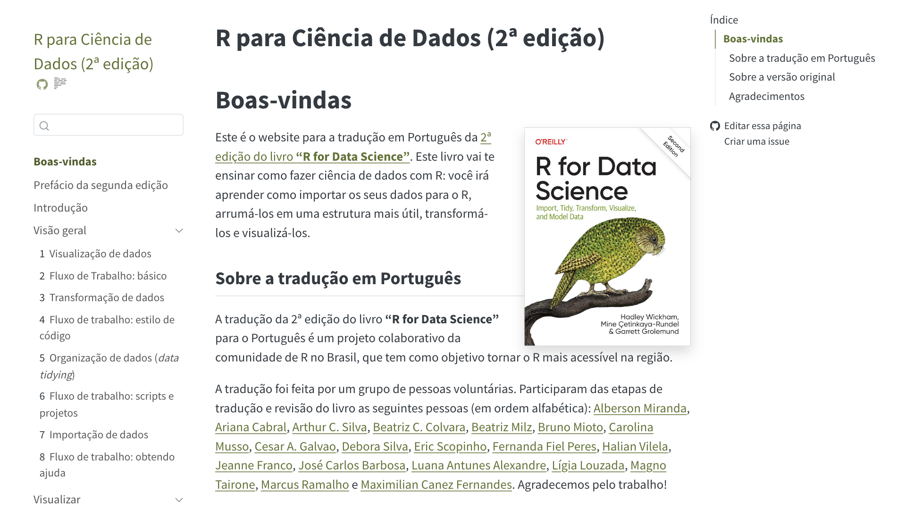{fig-align="center"}](https://pt.r4ds.hadley.nz/)

# DevGuide da rOpenSci {background-color="#562457"}

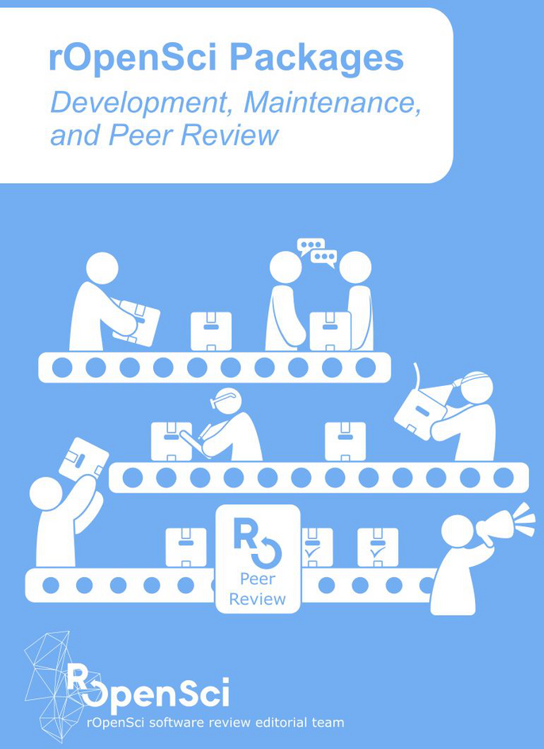{fig-align="center" height="400"}

## O que é a rOpenSci?

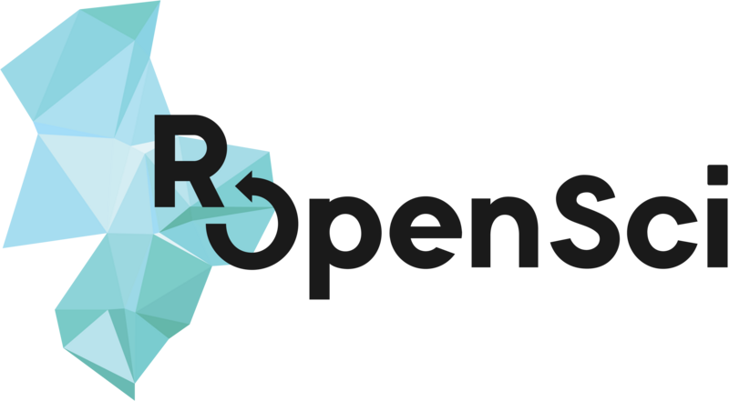{.nostretch width="30%"}

-   Organização sem fins lucrativos, fundada em 2011.

-   Promove pesquisa aberta e reprodutível, com dados compartilhados e software reutilizável.

-   Faz revisão por pares de pacotes R, com uma equipe de editoras e editores voluntários.

-   Busca construir uma comunidade acolhedora e diversa.

::: footer
Fonte: [About - rOpenSci](https://ropensci.org/about/)
:::

## Pacotes da rOpenSci

[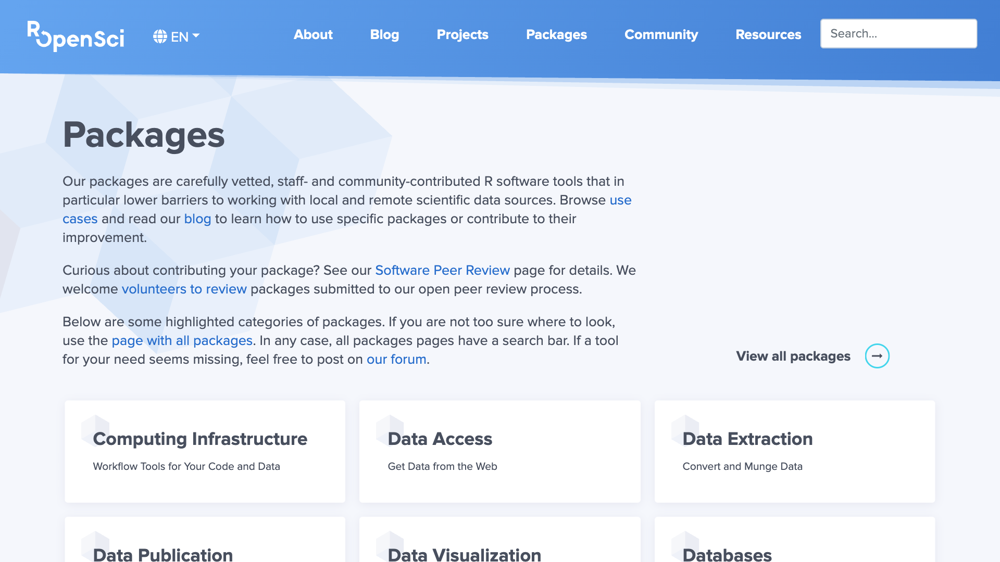{fig-align="center"}](https://ropensci.org/packages/)

## Exemplo: pdftools

[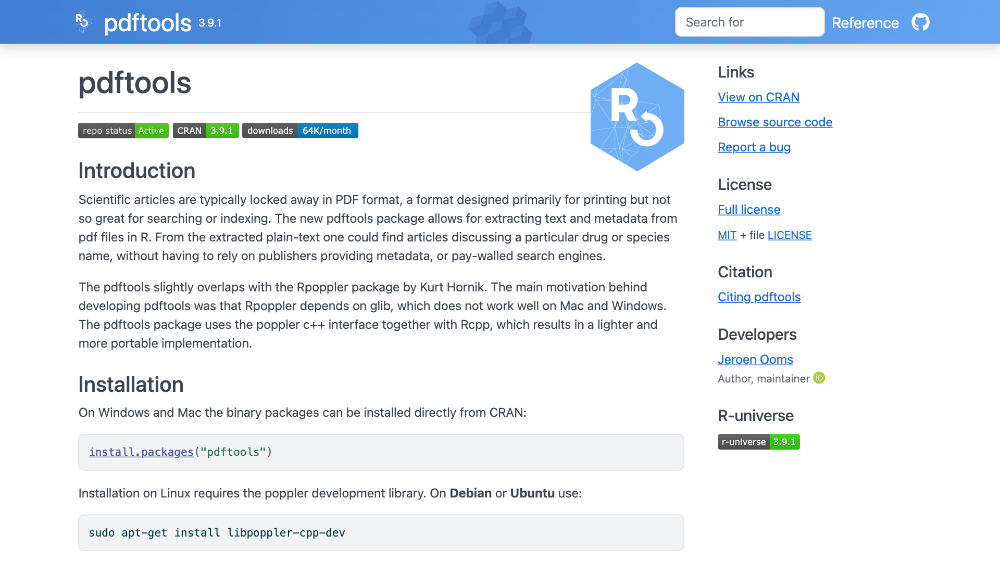{fig-align="center"}](https://docs.ropensci.org/pdftools/)

## Outros pacotes da rOpenSci

-   [targets](https://docs.ropensci.org/targets/): pipelines reprodutíveis, que reexecutam apenas o que mudou.

-   [skimr](https://docs.ropensci.org/skimr/): resumo rápido e legível de bases de dados.

-   [magick](https://docs.ropensci.org/magick/): processamento de imagens no R.

-   Veja todos em: [ropensci.org/packages](https://ropensci.org/packages/all/)

## DevGuide da rOpenSci

:::: {.columns}
::: {.column width="70%"}
-   Guia sobre desenvolvimento, manutenção e avaliação por pares de pacotes em R.

-   Tradução de jun/2023 a out/2025, com pessoas de Angola, Brasil e Portugal.

-   Coordenação: Yanina Bellini Saibene.

::: {.smaller}
-   Participação: Francesca Belem Lopes Palmeira, Beatriz Milz, António Pedro, Ariana Moura Cabral, Daniel Vartanian, Ildeberto Vasconcelos, João Granja-Correia, Marcelo Perlin, Pedro Faria, Rafael Fontenelle e Samuel Carleial Fernandes.
:::

<!-- -   2024: [Community Call](https://ropensci.org/commcalls/translation-portuguese/) "A comunidade R fala português" e Traslatón na LatinR. -->
:::

::: {.column width="30%"}

:::
::::

::: footer
Fonte: [Blog da rOpenSci](https://ropensci.org/pt/blog/2025/11/25/tradu%C3%A7%C3%A3o-devguide-pt/)
:::

## DevGuide: como a tradução é feita

-   Tradução inicial automática com o pacote [babeldown](https://docs.ropensci.org/babeldown/) (que usa o DeepL), e revisada por uma pessoa.

-   Hoje, toda alteração no DevGuide precisa ser traduzida para português e espanhol antes de ser incorporada na versão original (em inglês).

## Site do DevGuide em português

[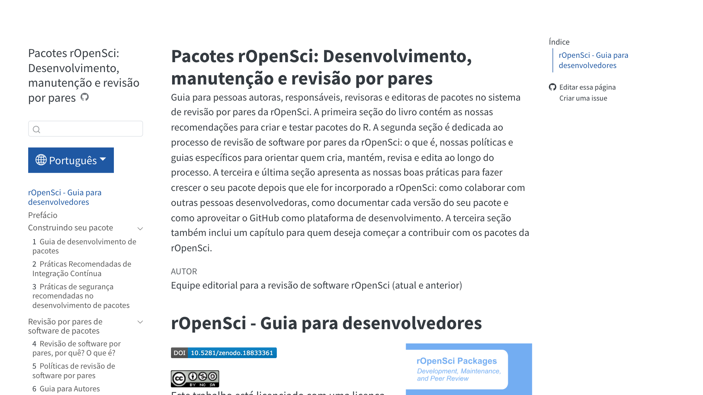{fig-align="center"}](https://devguide.ropensci.org/pt/index.pt.html)

# Tradução das mensagens do R {background-color="#562457"}

{fig-align="center" height="350"}

## Tradução das mensagens do R

:::: {.columns}
::: {.column width="55%"}
-   Tradução das mensagens (erros, avisos, etc.) do R e dos pacotes do "R base".

<!-- -   2022: R Traslatón na LatinR, em parceria com o R Contributors. -->

-   **Projeto aberto para contribuições!**
:::

::: {.column width="45%"}
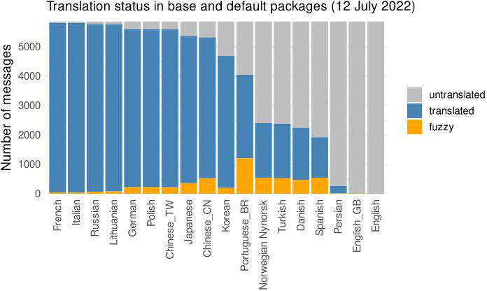
:::
::::

::: footer
Fonte do gráfico: [Blog do R](https://blog.r-project.org/2022/07/25/r-can-use-your-help-translating-r-messages/)
:::

<!-- ## Quem está por trás? -->

<!-- -   [R Contribution Working Group](https://contributor.r-project.org/working-group.html): colaboração entre o R Core, comunidades como **RLadies+**, Forwards e MiR, e a comunidade R em geral. -->

<!--     -   Objetivo: incentivar novas pessoas a contribuir com o R, com foco em diversidade e inclusão. -->

<!-- -   Equipes voluntárias de tradução para cada idioma. -->

<!-- -   A organização das traduções fica na organização [r-devel](https://github.com/r-devel) do GitHub: guias, glossário e painel de acompanhamento das traduções. -->

## Mensagens do R: em inglês

```{r}
#| include: false
Sys.setenv(LANGUAGE = "en")
```

```{r}
#| echo: true
#| error: true
mean(notas)

library(tidyvese)
```

## Mensagens do R: em português

Mudando o idioma das mensagens:

```{r}
#| echo: true
Sys.setenv(LANGUAGE = "pt_BR")
```

O mesmo código, agora com as mensagens traduzidas:

```{r}
#| echo: true
#| error: true
mean(notas)

library(tidyvese)
```

## Como traduzir as mensagens do R?

1.  Entre no [Zulip do R Project](https://contributor.r-project.org/zulip.html) e procure os canais da seção *Translation*.

2.  Crie uma conta no [Weblate](https://translate.rx.studio/), a plataforma onde as traduções são feitas.

3.  Leia as [orientações para tradução em português](https://contributor.r-project.org/translations/Conventions_for_Languages/Brazilian%E2%80%90Portugese-specific-translations.html).

4.  Escolha um [componente em português](https://translate.rx.studio/languages/pt_BR/r-project/) que não esteja 100% traduzido.

    -   Dica: comece por pacotes como `parallel` ou `methods`. Pacotes como `stats` têm muitos termos técnicos.

5.  Clique em *Unfinished strings* e comece a traduzir!

## Weblate

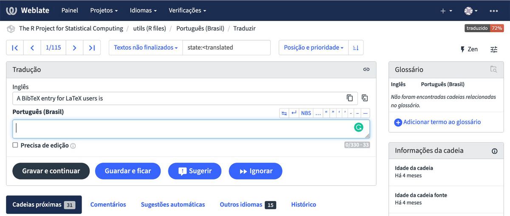{fig-align="center"}

::: footer
Mais informações: [R Contributors - Translations](https://contributor.r-project.org/translations/)
:::

## Materiais de apoio em português

-   [Live "Traduzindo o R"](https://www.youtube.com/watch?v=Mf9iwGEXRD8), com Caio Lente, no canal da Curso-R.

-   [Guia de tradução: Weblate](https://cienciadedatos.github.io/guia-traducao-ptbr/weblate.html).

-   [Community Call "A comunidade R fala português"](https://ropensci.org/commcalls/translation-portuguese/), da rOpenSci (2024), e os [slides da apresentação](https://beamilz.com/talks/pt/2024-11-05-ropensci-traducao-pt/).

## Próxima geração de contribuições ao R

-   Em 2025, o projeto *Enabling the Next Generation of Contributors to R* recebeu cerca de £500 mil do Research Software Maintenance Fund (Software Sustainability Institute, Reino Unido).

-   Objetivo: garantir a sustentabilidade do R Project.

-   Beatriz Milz e Fernando Correa estão trabalhando para melhorar a integração das traduções feitas no Weblate, com a mentoria do Gergely Daróczi (administrador do Weblate).

::: footer
Fonte: [RSMF: Enabling the Next Generation of Contributors to R - Blog do R](https://blog.r-project.org/2025/12/17/rsmf-enabling-the-next-generation-of-contributors-to-r/)
:::

<!-- Slide comentado para talvez usar depois

## Oportunidades que surgiram

-   2023: Caio Lente e Renata Hirota participaram do [R Project Sprint 2023](https://contributor.r-project.org/r-project-sprint-2023/) (University of Warwick, Reino Unido), contribuindo com a tradução do R.

-   2025: Beatriz Milz apresentou [a tradução do R4DS na posit::conf(2025)](https://beamilz.com/talks/en/2025-posit-conf/) (Atlanta, EUA), com bolsa da Posit.

-->

# Faça parte! {background-color="#562457"}

## Contribuições da RLadies+

-   O pedido para traduzir a 2ª edição do R4DS surgiu no Clube do livro da R-Ladies SP.

-   Comunidades como a RLadies+, a LatinR e a Curso-R foram essenciais para encontrar pessoas voluntárias.

-   O Clube do livro da R-Ladies SP ajuda a divulgar o livro traduzido.

<!-- -   A RLadies+ faz parte do R Contribution Working Group, que incentiva novas pessoas a contribuir com o R (inclusive com traduções). -->

::: r-hstack
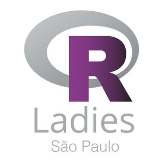{height="110"}

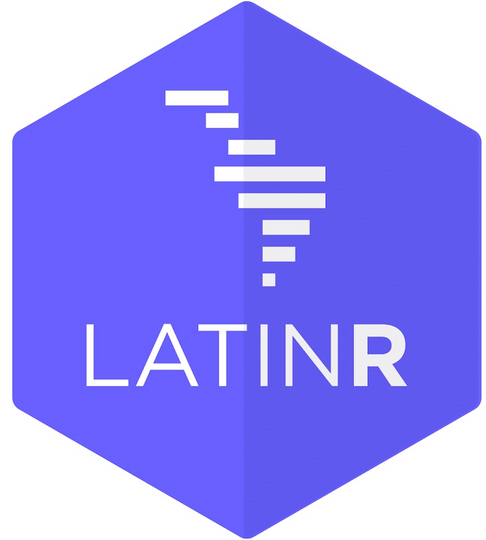{height="110"}

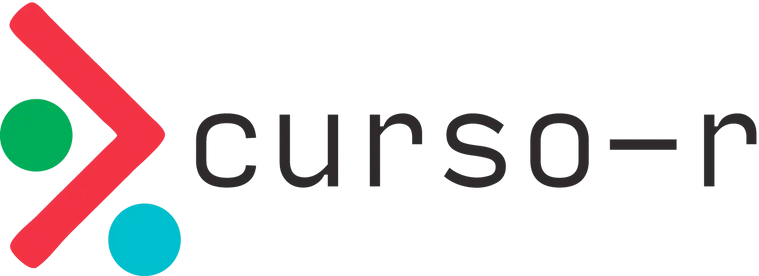{height="60"}
:::

## Por que participar?

-   Aprender na prática como funciona um pacote de R (e o próprio R por dentro).

-   Praticar Git e GitHub em um projeto real: issues, pull requests e revisão.

-   Construir portfólio e currículo.

-   Conhecer pessoas da comunidade R no Brasil e no mundo.

-   Abrir portas para oportunidades, como bolsas e participação em eventos.

## Como contribuir?

-   **Traduzir e revisar**: por exemplo, as mensagens do R no [Weblate](https://translate.rx.studio/).

-   **Avisar sobre problemas** encontrados (erros de tradução, links quebrados etc.), abrindo issues no GitHub: [livro](https://github.com/cienciadedatos/pt-r4ds/issues), [pacote dados](https://github.com/cienciadedatos/dados/issues), [DevGuide](https://github.com/ropensci/dev_guide/issues).

-   **Usar e divulgar os materiais**: estude pelo livro, use o pacote dados em aulas e compartilhe com colegas!

-   **Organizar eventos**: por exemplo, maratonas de tradução (como os Traslatóns da LatinR) ou clubes do livro (como o da R-Ladies SP).

## Saiba mais

-   RLadies+ Global: [Website](https://rladies.org/)

-   R-Ladies São Paulo:

    -   Blog: <https://rladies-sp.org/>
    -   [<i class="fab fa-linkedin"></i> Linkedin](https://www.linkedin.com/company/r-ladies-sao-paulo/)
    -   [<i class="fab fa-instagram"></i> Instagram](https://instagram.com/RLadiesSaoPaulo)
    -   [<i class="fab fa-meetup"></i> Meetup](https://www.meetup.com/rladies-sao-paulo/)
    -   [<i class="fab fa-github"></i> GitHub](https://github.com/R-Ladies-Sao-Paulo)
    -   [<i class="fab fa-youtube"></i> Youtube](https://www.youtube.com/c/RLadiesSãoPaulo)

# Obrigada! {background-color="#562457"}

Slides: [r-ladies-sao-paulo.github.io/2026-amostra-ime-usp](https://r-ladies-sao-paulo.github.io/2026-amostra-ime-usp/)

<!-- inicio font awesome -->

```{=html}
<script src="https://kit.fontawesome.com/1f72d6921a.js" crossorigin="anonymous"></script>
```

<!-- final font awesome -->
